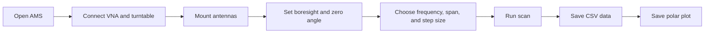

<p align="center">
  
</p>

<h1 align="center">AMS — Anechoic Chamber Measurement System</h1>

<p align="center">
  <strong>A one-screen Windows Python app for repeatable antenna radiation-pattern scans.</strong><br>
  Positioner motion, VNA acquisition, CSV export, live plotting, and polar radiation-pattern generation in one clean workflow.
</p>

<p align="center">
  
  
  
  
</p>

<p align="center">
  <a href="#quick-start">Quick Start</a> ·
  <a href="#showcase">Showcase</a> ·
  <a href="#what-it-does">What It Does</a> ·
  <a href="#outputs">Outputs</a> ·
  <a href="#safety-notes">Safety</a>
</p>

---

## Quick Start

### Step 1 — Open Command Prompt

Click the Windows search bar, type:

```text
Command Prompt
```

Open **Windows Command Prompt**.

### Step 2 — Copy and paste this into Command Prompt

```command prompt
winget install --id Git.Git -e --source winget
cd Documents
git clone https://github.com/prestonmavady/ams.git
cd ams
python -m pip install pyvisa pyserial numpy matplotlib
python ams.py
```

This should take ~3 minutes. **When you see 'python ams.py' in the command prompt, hit enter**. AMS should open.


---


## Running a Scan

1. Open AMS:

```powershell
cd $env:USERPROFILE\Documents\ams
python ams.py
```

2. Connect the VNA and FS-121 turntable.
3. Mount the antenna under test.
4. Align the receive antenna.
5. Set the scan frequency.
6. Set the angular span.
7. Set the step size.
8. Zero the positioner at boresight.
9. Run the radiation-pattern scan.
10. Open the saved results folder.


---


### One-screen scan control

<p align="center">
  
</p>

The AMS GUI keeps the full measurement workflow on one screen: positioner controls, VNA settings, scan parameters, live plots, saved results, and debug messages.

### Physical chamber setup

<p align="center">
  
</p>

The system is built around a compact anechoic chamber with RF absorber, a rotating antenna-under-test fixture, and a fixed receive antenna.


---

## System Workflow



---

## Outputs

AMS saves measurement data and plots that can be used in lab reports, design reviews, and antenna verification work.

<div align="center">
  <table>
    <tr>
      <td width="44%" align="center">
        <br>
        <sub><strong>CSV / text output</strong><br>Angle, gain, and phase.</sub>
      </td>
      <td width="56%" align="center">
        <br>
        <sub><strong>Polar plot output</strong><br>Normalized radiation pattern.</sub>
      </td>
    </tr>
  </table>
</div>

Example scan data:

```text
Phi (deg)    Log Magnitude (dB)    Phase (deg)
-180.000     -34.113               -164.125
-170.000     -33.580                176.359
-160.000     -33.225                152.625
...
```
