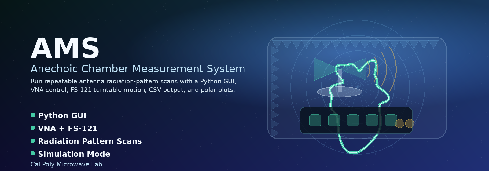
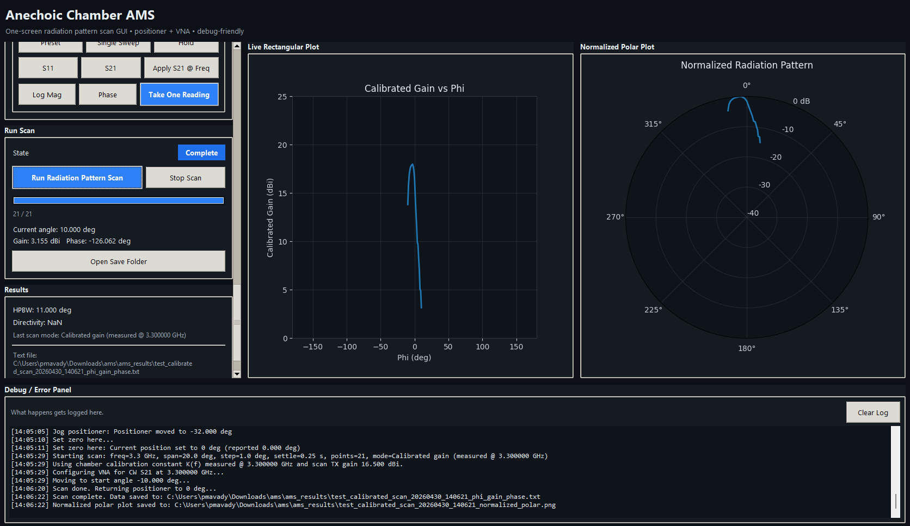
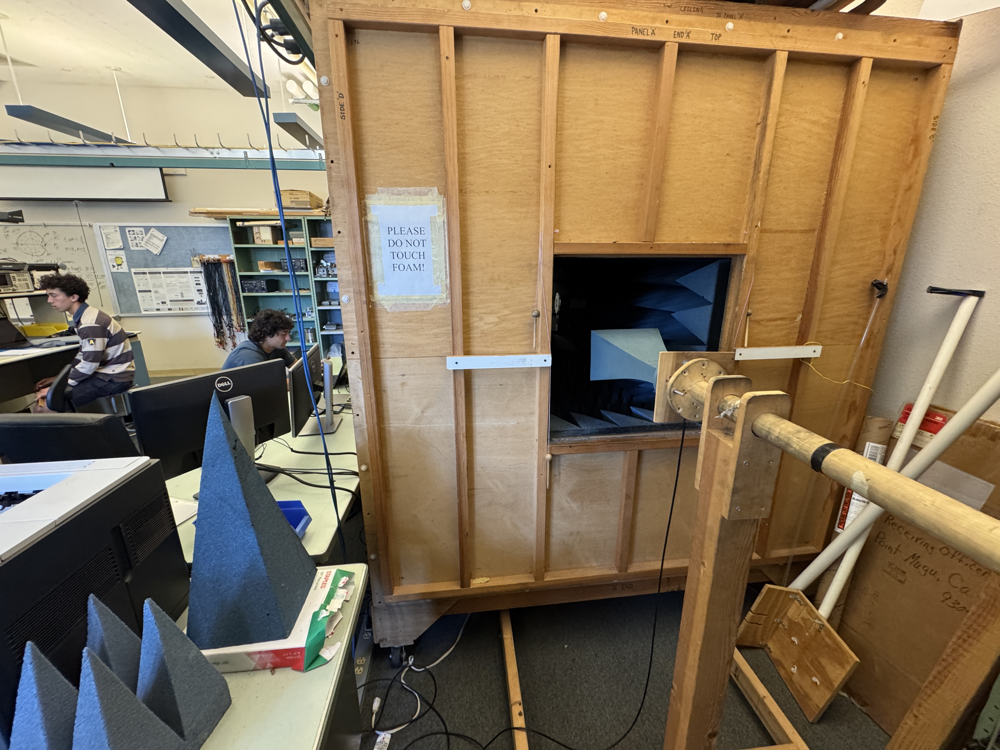
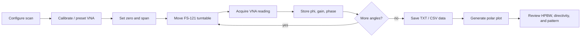
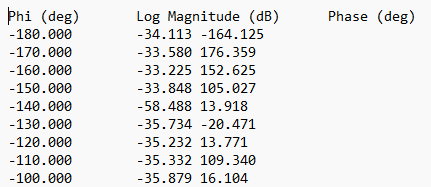
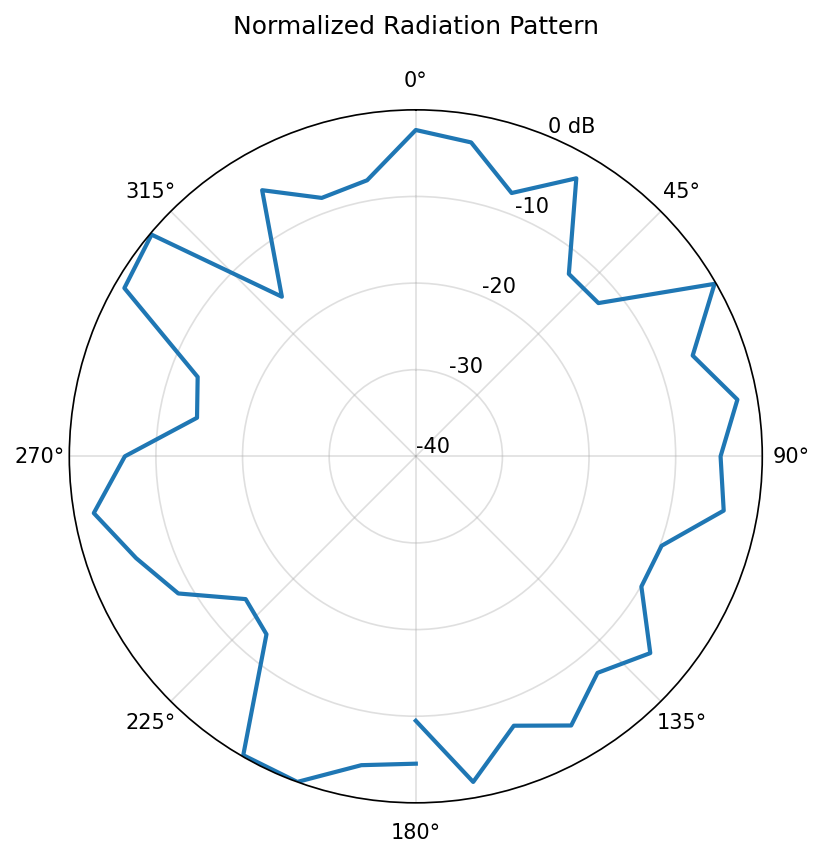

<p align="center">
  
</p>

<h1 align="center">AMS — Anechoic Chamber Measurement System</h1>

<p align="center">
  <strong>A one-screen Python control system for repeatable antenna radiation-pattern scans.</strong><br>
  Positioner motion, VNA acquisition, calibrated gain processing, CSV export, and polar-plot generation in one modern workflow.
</p>

<p align="center">
  
  
  
  
</p>

<p align="center">
  <a href="#showcase">Showcase</a> ·
  <a href="#what-it-does">What it does</a> ·
  <a href="#system-workflow">Workflow</a> ·
  <a href="#hardware-stack">Hardware</a> ·
  <a href="#outputs">Outputs</a> ·
  <a href="#quick-start">Quick start</a>
</p>

---

## Overview

**AMS** is an automated antenna measurement system built for the Cal Poly Microwave Lab anechoic chamber. It combines a Python GUI, vector network analyzer control, Sunol Sciences FS-121 turntable motion, radiation-pattern acquisition, calibrated gain processing, debug logging, and export-ready plots into a single operator-friendly interface.

The goal is simple: make antenna measurements faster, cleaner, more repeatable, and easier to teach.

Instead of manually rotating an antenna under test, collecting individual VNA readings, and post-processing everything by hand, AMS coordinates the entire scan loop:

```text
move turntable -> wait for settle -> read VNA -> log angle/gain/phase -> update plots -> export results
```

---

## Showcase

### One-screen scan control

<p align="center">
  
</p>

The AMS GUI is designed around live feedback. The operator can jog the positioner, configure VNA measurements, run a full radiation-pattern scan, monitor progress, inspect the current gain and phase, view rectangular and polar plots, and read debug output from the same screen.

### Physical chamber setup

<p align="center">
  
</p>

The system is built around a compact anechoic chamber with RF absorber, a rotating antenna-under-test fixture, and a fixed receive antenna position. The setup is intended for hands-on antenna characterization and repeatable lab measurements.

---

## What it does

<table>
  <tr>
    <td><strong>Automated scans</strong></td>
    <td>Steps the antenna through a configurable angular span and records VNA readings at each point.</td>
  </tr>
  <tr>
    <td><strong>Positioner control</strong></td>
    <td>Controls the Sunol Sciences FS-121 turntable over serial/RS-232-style commands.</td>
  </tr>
  <tr>
    <td><strong>VNA measurements</strong></td>
    <td>Supports S-parameter-style workflows, including gain and phase capture for radiation-pattern scans.</td>
  </tr>
  <tr>
    <td><strong>Calibrated gain mode</strong></td>
    <td>Applies chamber and scan calibration so measurements can be displayed as calibrated gain versus angle.</td>
  </tr>
  <tr>
    <td><strong>Live plotting</strong></td>
    <td>Updates rectangular gain-vs-angle and normalized polar radiation-pattern views during operation.</td>
  </tr>
  <tr>
    <td><strong>Export pipeline</strong></td>
    <td>Saves tabulated scan data, normalized polar plots, and reproducible result files for later analysis.</td>
  </tr>
  <tr>
    <td><strong>Debug-friendly operation</strong></td>
    <td>Logs positioner motion, VNA configuration, scan progress, output paths, and error messages.</td>
  </tr>
</table>

---

## System workflow



---

## Hardware stack

| Layer | Component | Role |
|---|---|---|
| Chamber | Anechoic chamber with RF absorber | Reduces reflections and creates a controlled antenna test environment |
| Motion | Sunol Sciences FS-121 turntable | Rotates the antenna under test through the requested scan angles |
| Instrumentation | Vector Network Analyzer | Measures S-parameters, gain, and phase at each angular point |
| Antenna fixture | AUT + receive antenna mounts | Holds antennas at repeatable alignment and polarization |
| Software | Python GUI | Coordinates scan setup, hardware control, plotting, saving, and debugging |
| Output | Text/CSV + PNG plots | Produces analysis-ready measurement files and publication-ready figures |

---

## Outputs

AMS produces clean, timestamped measurement artifacts that can be used directly in lab reports, design reviews, and antenna verification workflows.

<div align="center">
  <table>
    <tr>
      <td width="44%" align="center">
        <br>
        <sub><strong>Tabulated scan data</strong><br>Angle, gain/log magnitude, and phase.</sub>
      </td>
      <td width="56%" align="center">
        <br>
        <sub><strong>Normalized polar plot</strong><br>Radiation pattern exported as a clean PNG figure.</sub>
      </td>
    </tr>
  </table>
</div>

Typical scan data format:

```text
Phi (deg)    Log Magnitude (dB)    Phase (deg)
-180.000     -34.113               -164.125
-170.000     -33.580                176.359
-160.000     -33.225                152.625
...
```

---

## Key features

- **One-screen operation** — manual jog controls, scan execution, plotting, results, and logs live together.
- **Single-reading mode** — quickly capture one VNA reading for debug, setup, or calibration checks.
- **Full radiation-pattern scans** — sweep a user-selected angular span with configurable step size and settle time.
- **Live rectangular plot** — view calibrated gain versus phi as the scan is running.
- **Normalized polar plot** — instantly visualize the antenna pattern in a familiar RF format.
- **Status and progress tracking** — current angle, point count, scan mode, saved output path, and completion state are visible.
- **Debug log panel** — every major action is timestamped for easier troubleshooting.
- **Export-ready files** — saves raw numeric data and rendered plots into the results folder.

---

## Example scan

The GUI screenshot above shows a calibrated gain scan at **3.300 GHz** with:

| Parameter | Example value |
|---|---:|
| Scan span | 20° |
| Step size | 1° |
| Settle time | 0.25 s |
| Points | 21 |
| Reported HPBW | 11.000° |
| Estimated directivity | NaN in the shown debug run |

AMS records each angle, reads the VNA, updates the plots, then exports both the tabulated data file and normalized polar plot.

---

## Repository layout

```text
ams/
├── README.md
├── docs/
│   ├── ams_hero.png
│   ├── ams_gui.png
│   ├── chamber_setup.JPG
│   ├── csv_output.png
│   └── polar_output.png
├── src/
│   └── ...
├── results/
│   └── ...
└── tests/
    └── ...
```

> The image paths in this README assume the five showcase images live in `docs/` relative to the repository root.

---

## Quick start

### 1. Install dependencies

Create and activate a Python environment, then install the project requirements.

```bash
python -m venv .venv
source .venv/bin/activate      # macOS/Linux
# .venv\Scripts\activate       # Windows

pip install -r requirements.txt
```

### 2. Connect hardware

1. Connect the VNA to the control computer.
2. Connect the FS-121 turntable to the control computer.
3. Mount the antenna under test on the rotating fixture.
4. Mount and align the receive antenna.
5. Route RF cables with large bend radii and enough slack for the requested rotation.
6. Verify that the antenna can rotate through the full requested span without cable strain.

### 3. Launch AMS

```bash
python main.py
```

### 4. Run a scan

1. Set or jog the positioner to boresight.
2. Zero the current angle.
3. Choose the scan span, step size, frequency, measurement mode, and settle time.
4. Run the radiation-pattern scan.
5. Review the live rectangular and polar plots.
6. Open the saved output folder for the raw data and exported figure.

---

## Measurement modes

| Mode | Purpose |
|---|---|
| `S11` | Reflection measurement for antenna matching checks |
| `S21` | Transmission measurement through the chamber path |
| `Log Mag` | Magnitude-focused gain / loss display |
| `Phase` | Phase measurement display |
| `Calibrated gain` | Gain-versus-angle scan with chamber/system calibration applied |
| `Simulation / debug mode` | GUI and workflow testing without requiring the full hardware stack |

---

## Design goals

AMS was built to feel like a polished lab instrument rather than a pile of scripts.

| Goal | How AMS addresses it |
|---|---|
| Repeatability | Motorized angular stepping and consistent VNA acquisition timing |
| Usability | Single-screen GUI with clear state, progress, and results panels |
| Debuggability | Timestamped log output and explicit saved file paths |
| Teaching value | Live plots make antenna behavior visible during the scan |
| Portability | Python-based workflow intended to be easier to maintain and extend |
| Documentation | Showcase images and exported artifacts make results easy to communicate |

---

## Safety and handling notes

- Do not touch or compress the chamber absorber foam.
- Keep coax bends gentle; damaged RF cables can ruin measurements.
- Confirm turntable clearance before running automated motion.
- Keep cable slack controlled so the AUT can rotate safely.
- Start with small spans and slow motion when testing a new antenna fixture.
- Stop the scan immediately if the antenna, cable, or fixture begins to bind.

---

## Future improvements

- Add swept-frequency radiation-pattern scans.
- Add automatic HPBW and side-lobe-level annotations to exported plots.
- Add richer calibration profiles per antenna and chamber setup.
- Add automated report generation after a completed scan.
- Add hardware abstraction layers for additional VNAs and positioners.
- Add CI-tested simulation mode for development without lab hardware.

---

## Project identity

**AMS** stands for **Anechoic Chamber Measurement System**.

It exists to make antenna characterization more approachable, repeatable, and visually intuitive for students, researchers, and RF engineers working in the Cal Poly Microwave Lab.

<p align="center">
  <strong>Python GUI · VNA control · FS-121 motion · CSV output · polar plots</strong>
</p>

