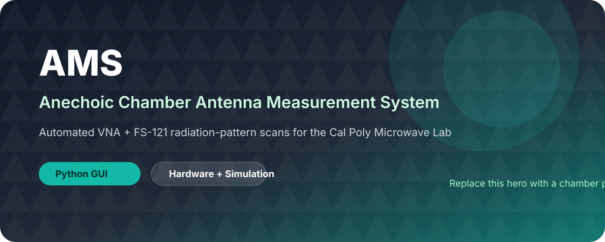
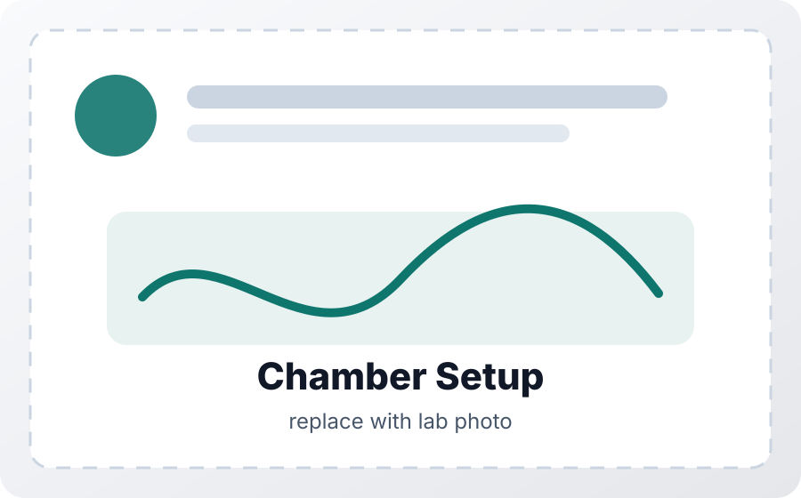
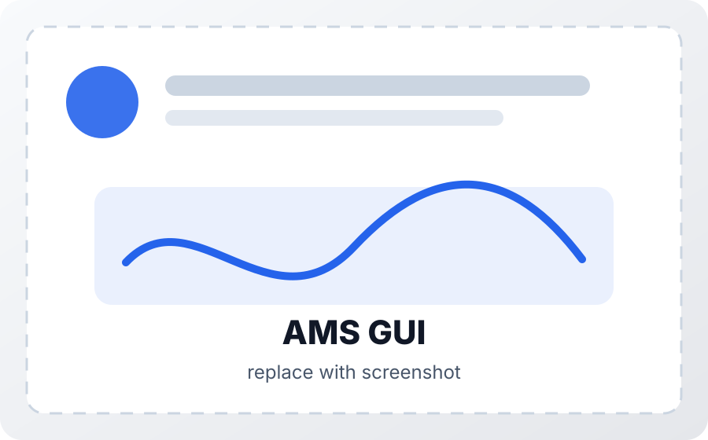
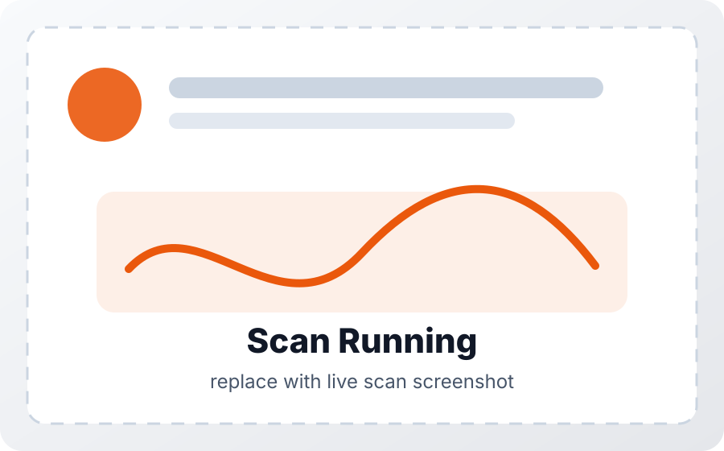
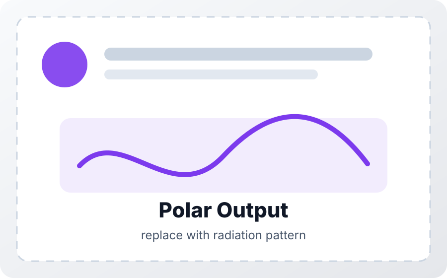
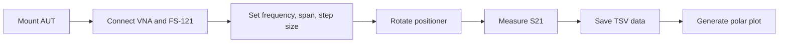

<div align="center">
  

  <h1>AMS</h1>
  <p><strong>Antenna Measurement System for the Cal Poly Microwave Lab Anechoic Chamber</strong></p>

  <p>
    
    
    
    
  </p>
</div>

---

**AMS** is a Python-based control interface for running antenna radiation-pattern scans in an anechoic chamber. It coordinates a vector network analyzer, a Sunol Sciences FS-121 positioner, and a clean Tkinter GUI to rotate an antenna under test, collect S21 measurements, and save normalized polar radiation plots.

## Install

```bash
git clone https://github.com/prestonmavady/ams.git
cd ams

python -m venv .venv
source .venv/bin/activate        # macOS/Linux
# .venv\Scripts\activate       # Windows

pip install numpy matplotlib pyvisa pyvisa-py
python ams/ams.py
```

For real hardware, also install the correct drivers for your lab computer:

- **NI-VISA** or another compatible VISA backend
- **GPIB-to-USB driver** for the VNA
- **USB-to-RS-232 driver** for the FS-121 positioner

No chamber access? Enable **Simulation Mode** in the GUI to test the workflow without instruments connected.

## Preview

<table>
  <tr>
    <td width="50%"></td>
    <td width="50%"></td>
  </tr>
  <tr>
    <td align="center"><strong>Chamber Setup</strong><br><sub>Replace with a wide photo of the chamber, AUT fixture, receive antenna, and cabling.</sub></td>
    <td align="center"><strong>AMS GUI</strong><br><sub>Replace with a screenshot of the configured scan window.</sub></td>
  </tr>
  <tr>
    <td width="50%"></td>
    <td width="50%"></td>
  </tr>
  <tr>
    <td align="center"><strong>Scan in Progress</strong><br><sub>Replace with a screenshot while AMS is collecting angle points.</sub></td>
    <td align="center"><strong>Radiation Pattern Output</strong><br><sub>Replace with an exported normalized polar plot.</sub></td>
  </tr>
</table>

To use real images, place them in `docs/images/` and either overwrite the placeholder SVGs or update the image paths in this README.

## What AMS Does

AMS turns a manual chamber measurement into a repeatable scan workflow:



Core capabilities:

- Connects to a VNA over VISA/GPIB
- Controls a Sunol Sciences FS-121 turntable over RS-232
- Runs full or partial azimuth radiation-pattern scans
- Records S21 magnitude and phase versus angle
- Saves tab-delimited data for MATLAB, Python, Excel, or reports
- Generates normalized polar plots automatically
- Supports chamber calibration profiles for corrected measurements
- Includes simulation mode for software testing without hardware

## Hardware Setup

Typical measurement chain:

| Connection | Description |
|---|---|
| VNA Port 1 | Antenna under test on the rotating FS-121 fixture |
| VNA Port 2 | Receive/reference antenna on the fixed fixture |
| PC to VNA | USB/GPIB adapter through VISA |
| PC to FS-121 | USB/RS-232 adapter |
| Chamber | Panels closed before measurement |

Default resources in the GUI:

```text
Positioner: ASRL5::INSTR
VNA:        GPIB0::28::INSTR
```

Update these fields if your COM port, GPIB address, or VISA backend is different.

## Run a Radiation-Pattern Scan

1. Launch AMS.
2. Select the VISA backend if needed. Leave blank for the default backend, or use `@py` for `pyvisa-py`.
3. Confirm the VNA and positioner resource strings.
4. Click **Connect**.
5. Choose the save folder and base file name.
6. Enter scan settings:
   - **CW frequency** in GHz
   - **Scan span** in degrees, usually `360`
   - **Step size** in degrees
   - **Settle delay** after each move
7. Verify the AUT is secure, near boresight, and the cable will not twist or snag.
8. Click **Run Scan**.
9. Save the generated `.tsv` data and `.png` polar plot with your lab notes.

## Outputs

| File | Description |
|---|---|
| `*_pattern.tsv` | Angle, S21 log magnitude, and phase data |
| `*_polar.png` | Normalized polar radiation-pattern plot |
| `ams_chamber_calibration_profile.json` | Saved chamber calibration profile |
| `ams_chamber_calibration_table.tsv` | Human-readable calibration table |

Partial scans are padded at `-180` and `+180` with `NaN` rows so downstream plotting tools keep a consistent angular range.

## Chamber Calibration

Use chamber calibration when you need corrected measurements instead of only relative normalized patterns.

1. Mount known/reference TX and RX antennas at boresight.
2. Enter the frequency range and frequency step.
3. Enter the known antenna gains.
4. Click **Run Chamber Calibration**.
5. Keep **Apply saved chamber calibration** enabled for corrected scans.

For quick shape checks, an uncorrected normalized scan is usually sufficient. For report-quality measurements, calibrate the VNA and chamber setup first.

## Safety Checklist

Before every scan:

- [ ] AUT is mechanically secure.
- [ ] SMA/coax cables have large-radius bends.
- [ ] Cable path will not twist, snag, scrape foam, or pull tight.
- [ ] Chamber foam is not being touched or compressed.
- [ ] Chamber panels/windows are closed.
- [ ] Scan span and zero position are reasonable.
- [ ] **Stop** button is visible and ready if anything moves incorrectly.

## Troubleshooting

| Symptom | Check |
|---|---|
| VNA will not connect | GPIB address, cable, VISA installation, VNA power, and backend setting |
| Positioner will not connect | COM port, USB/RS-232 driver, power strip, and resource string |
| Positioner moves incorrectly | Stop, re-zero, verify CW/CCW orientation, then jog slowly |
| Pattern is flat or noisy | Frequency, antenna alignment, VNA calibration, port connections, and chamber closure |
| Cable begins twisting | Stop immediately, reroute the cable, re-zero, and restart |
| No hardware available | Enable Simulation Mode |

## Project Structure

```text
ams/
└── ams.py          # GUI, hardware control, scan logic, calibration, plotting

docs/images/        # README photos and screenshots
```

## Suggested Image Replacements

| File | Replace with |
|---|---|
| `docs/images/ams_hero.svg` | Wide hero image of the chamber or AMS in use |
| `docs/images/chamber_setup.svg` | Full chamber measurement setup |
| `docs/images/ams_gui.svg` | AMS main GUI configured for a scan |
| `docs/images/scan_running.svg` | GUI while collecting scan data |
| `docs/images/polar_output.svg` | Example generated polar radiation pattern |

## Notes for Maintainers

- Keep **Simulation Mode** working so AMS can be developed without chamber access.
- Keep hardware resource strings easy to edit from the GUI.
- Prefer simple tab-delimited outputs so results remain usable in MATLAB, Python, Excel, and lab reports.
- Document any chamber-specific defaults directly in the README when the lab setup changes.

## Credits

Built for the Cal Poly Electrical Engineering Microwave Lab anechoic chamber. The Python implementation follows the original AMS measurement workflow while making the system easier to run, teach, and maintain.
